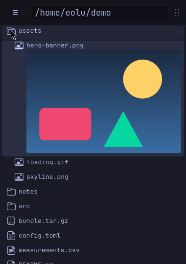
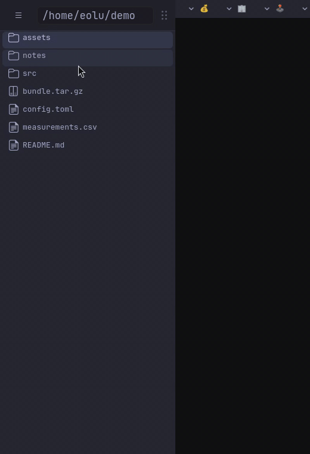
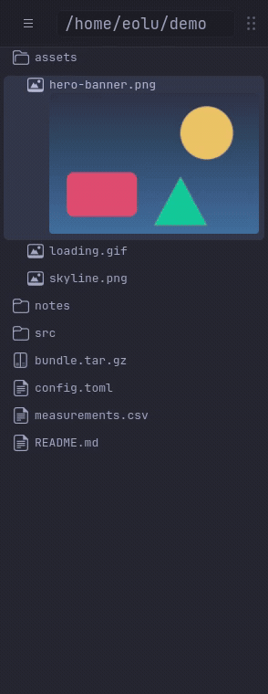
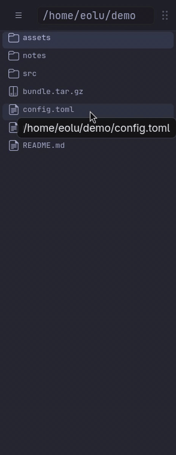

# tree-space

A wayland file manager that lives on the edge of your screen, inspired by the vscode explorer.



tree-space docks a keyboard-driven file tree to a screen edge, out of the way of your normal windows. It is built for
people who want a real, full-featured file manager that is always one keystroke
away instead of a window they have to open, arrange, and lose behind other
things. It runs best on Wayland compositors that implement `wlr-layer-shell`
(Hyprland, sway, river, niri, and other wlroots-based compositors).

The interface will feel familiar if you have used the file explorer in a text
editor: a hierarchical, keyboard-first tree with inline rename, previews, and a
status line, rather than a grid of tiles.

## What it does

The aim is feature parity with the file managers you already use, plus
configuration that most of them do not offer.

**Full file management.** Create, rename, duplicate, and delete files and
folders. Cut/copy/paste internally and to and from the system clipboard. Move
files to the trash (through GIO, so it is recoverable) or delete them
permanently. Create symlinks. Inspect and edit ownership and permissions. Copy
absolute or root-relative paths.

**Drag and drop, both directions.** Drag files out to any other application
(editor, terminal, browser, chat client) and drop files from other applications
in. Dropping onto a folder moves the files there; hold Ctrl to copy. Drag the
whole selection, not just one row.

**Navigation.** Per-pane back/forward history, open a folder as a new split pane,
open it in the opposite dock, filter the current listing, and choose what the
panel opens to on startup.

**Previews.** Toggle an inline preview below any row. Images, video and audio
(play/pause, seek, volume), animated GIFs that play on click, text and source
snippets, CSV/TSV tables, JSON/TOML/YAML with a validity check, and archive
contents. The type is sniffed from the file's bytes, not just its extension.

**Details when you need them.** A Properties dialog modelled on Nautilus, with
editable name, MIME type, size, timestamps, free space, link targets, and a
live permissions/ownership editor.

**Selection.** Ctrl+click, Shift+click, Shift+Arrow, and Ctrl+Shift+Arrow
selection, with a context menu that acts on the whole selection at once.

**Bookmarks.** A new panel opens showing bookmarks: a list of suggested
directories to jump to. Clicking one replaces the view with that folder, so a
split starts as a launcher rather than an empty tree. Bookmark entries can be
renamed, re-pointed, or deleted from their right-click menu. See
[Bookmarks](#bookmarks).

**Configurable context menus and hotkeys.** Every context menu is an ordered list of rules, and a rule can
match on almost anything: whether the row is a directory, files with no
extension, one or more filename extensions, a regular expression against the
full path, a multi-row selection, or everything else as a fallback. The first
rule that matches supplies the whole menu, so you can give `.rs` files their own
actions, give files under `~/Projects` a different set, and bind keys to any of
them. Menus can nest. Rules can live in separate files so they do not clutter
the main config. See [Context menus](#context-menus).

> Docking needs the `wlr-layer-shell` protocol. On a compositor that does not
> provide it (GNOME/Mutter, KDE/KWin) the panel cannot dock: it opens as a
> normal, freely floating window instead and prints a one-line notice on
> startup. Everything else works; it just does not stick to the screen edge.

## Installation

tree-space is Wayland-only and needs a compositor that implements
`wlr-layer-shell` (Hyprland, sway, river, niri, and other wlroots-based
compositors). On a compositor that does not provide it (GNOME/Mutter,
KDE/KWin) the panel still runs, but as a floating window rather than a dock.

### Arch / Omarchy

The PKGBUILDs live in `packaging/aur/`. They are not on the AUR yet, so build
the package locally:

```bash
git clone https://github.com/Eolu/tree-space
cd tree-space/packaging/aur/tree-space
makepkg -si
```

The package installs `/usr/bin/tree-space` (the `/usr/bin/ts` name belongs to
`moreutils`), the desktop entry and the icon. It does **not** change your
default file manager; see
[Making it your default file manager](#making-it-your-default-file-manager).

> Once the packages are accepted on the AUR, `yay -S tree-space` (release) and
> `yay -S tree-space-git` (latest `master`) will work instead.

### cargo install

```bash
cargo install tree-space                          # inline audio player (GStreamer)
cargo install tree-space --no-default-features    # no GStreamer dependency
```

This installs both `ts` (short, for interactive use) and `tree-space` (used by
desktop entries and packaging). The system libraries below must be present.

### From source

```bash
git clone https://github.com/Eolu/tree-space
cd tree-space
./install.sh              # build + install to ~/.local
```

`./install.sh` builds the release binary and installs it, the desktop entry,
the icon and the folder/file MIME handler under `~/.local`. `./uninstall.sh`
undoes it. Run `./install.sh --help` for the options (`--prefix DIR`,
`--no-build`, `--no-desktop`); `--no-desktop` installs the binary only.

### Build dependencies

Rust **1.88 or newer** (edition 2024), plus the GTK4,
`gtk4-layer-shell` and (optionally) GStreamer development packages:

| Distribution | Packages |
| --- | --- |
| Arch / Omarchy | `gtk4 gtk4-layer-shell gstreamer gst-plugins-base gst-plugins-good pkgconf` |
| Debian / Ubuntu | `libgtk-4-dev libgtk4-layer-shell-dev libgstreamer1.0-dev libgstreamer-plugins-base1.0-dev pkg-config` |
| Fedora | `gtk4-devel gtk4-layer-shell-devel gstreamer1-devel gstreamer1-plugins-base-devel pkgconf` |

The inline audio player needs GStreamer; build with `--no-default-features` to
drop that dependency (audio files then have no inline player). See
[Building](#building).

## Usage

```
ts [OPTIONS] [PATH ...]
```

Run with no arguments it starts the panel (or toggles an already-running one).
Passing one or more paths opens a pane for each — a directory opens itself, a
file opens its containing folder and selects the file. The examples below use
`ts`, the short alias for the `tree-space` binary; both are identical.

| Argument | Meaning |
| --- | --- |
| `PATH ...` | Paths to open. A directory opens as a pane (an already-open directory is never duplicated). A file opens its folder and selects the file. |
| `-s, --side <left\|right>` | Which screen edge to dock to. Defaults to the configured side. |
| `--select <PATH>` | Reveal a path: open its containing folder and select it. This is what the `.desktop` entry uses. |
| `-H, --hidden` | Launch (or keep) the panel hidden. Never shows it. |
| `-w, --width <W>` | Resize a dock: `420` is an absolute width in px, `+40`/`-40` is a delta. `--side` picks the dock. Never changes visibility. |
| `-k, --key <ACCEL>` | Run a configured shortcut (`Ctrl+c`, `F2`, `Alt+Left`, …) against the active pane as if the key were pressed. Needs no keyboard focus, so an external button deck can drive the panel. Never changes visibility. |
| `-V, --version` | Print the version and exit. |
| `-h, --help` | Print the usage message. |

```
ts                        # start the panel, or toggle it if it is open
ts ~/dev                  # open a pane rooted there
ts ~/notes.md             # open the folder and select notes.md
ts --side right /tmp      # dock a pane to the right edge
ts --hidden               # start hidden (or hide a running panel)
ts --width +40            # widen the running panel by 40px
ts --key Ctrl+c           # copy the cursor row without focusing the panel
TREE_SPACE_DIRS=/a:/b ts  # open panes for directories from the environment
```

Only one panel runs at a time. A second invocation forwards its intent to the
running instance over a socket and exits; see
[Single instance](#single-instance) for the exact rules.

## Configuration

Everything is optional. On first launch tree-space writes a commented
`config.toml`, `main.css`, and `bookmarks.toml` to `~/.config/tree-space/` for
you to edit. A partial config is merged with the defaults, a broken one falls
back to the defaults with a message in the status bar, and out-of-range values
are clamped.

```toml
[panel]
side = "left"      # which edge to dock to: "left" | "right"
layer = "bottom"   # stacking layer: "background" | "bottom" | "top" | "overlay"
width = 300        # width in px
margin = 0         # gap from the screen edge in px
nav_toolbar = false # show a nav toolbar (up, back, forward) below the path bar

[tree]
dirs_first = true          # list directories above files
sort_key = "name"          # "name" | "size" | "modified" | "type"
sort_ascending = true
show_hidden = false
font_size = 13
icon_size = 18
confirm_drop_move = false  # ask before a drag-and-drop move

[bookmarks]
file = "bookmarks.toml" # the list, relative to this config (or absolute)
```

`[panel] nav_toolbar` adds a small row of navigation buttons (up one level,
back, forward) directly below the path bar. They mirror the corresponding
`[pane_menu]` actions, and each button's enabled state follows the pane (Up
only when there is a parent directory and the tree is showing; Back/Forward
only when history exists that way). It is off by default.

Three things are worth calling out:

- **Context menus and hotkeys** are configured with `[[context_menu.rules]]`.
  This is the heart of the project; the full syntax is in
  [Context menus](#context-menus).
- **Bookmarks** are the default view of a new panel: a list of directories to
  jump from, stored in their own file. See [Bookmarks](#bookmarks).
- **The stylesheet** is a plain CSS file at `~/.config/tree-space/main.css`. Edit
  it and restart to restyle the tree, menus, dialogs, and drag badges. See
  [Styling](#styling).

## Contributing

The project is developed against Hyprland and is not yet tested on other
compositors; reports and fixes for those are welcome. It is Wayland-only by
design and there is no plan to support X11.

If you hit something that a file manager "should" do, that is exactly the kind
of issue worth filing — feature parity is the goal.

---

# Reference

The rest of this document is the detailed reference: the exact menu syntax,
every built-in action and its default shortcut, the command-line behaviour, and
the internals of a few features.

## Context menus

Right-click menus on tree rows are configurable. The config is an ordered list
of rules, checked top-down; the **first rule with a matching entry wins** and
supplies the whole menu. Rows that no rule claims get the built-in default menu
(the classic file-manager items with their default shortcuts).



```toml
[[context_menu.rules]]
matches = ["ext:rs", "ext:toml"]                       # files ending in .rs or .toml
items = [
    "Open",
    { command = "foot -D {dir}", label = "Open in Terminal" },
    "---",                                             # horizontal divider
    { action = "Cut", shortcut = "Ctrl+x" },
    { command = "cargo fmt", label = "Format", shortcut = "Ctrl+Shift+f" },
]

[[context_menu.rules]]
matches = ["dir"]                                      # any directory
items = ["Open in Split View", "New Folder", "Move to Trash", "Delete Permanently"]

[[context_menu.rules]]
matches = ["noext"]                                    # files with no extension
items = ["Open", { command = "sh {path}" }]

[[context_menu.rules]]
matches = ['regex:.*\.lock$']                          # lockfiles anywhere in the path
items = ["Open", { command = "rm {path}", label = "Discard lock" }]

[[context_menu.rules]]
matches = ['regex:^/home/me/Projects/']                # anything under this directory
items = ["Open", { command = "foot -D {dir}", label = "Open in Terminal" }, "Open in Split View"]

[[context_menu.rules]]
matches = ["fallback"]                                 # anything not claimed above
items = ["Open", "Duplicate", "Copy Path"]
```

Right-clicking the blank area below the rows opens the menu for the directory
currently open in the pane. Left-clicking that area clears the selection; while
nothing is selected, action shortcuts target the open directory (`New File`,
`Paste`, `Open in Terminal`, ...) and row-specific ones (`Rename`, `Delete`, ...)
do nothing.

### `matches`

A rule matches a row when any of its matchers does.

| Matcher | Matches |
| --- | --- |
| `"dir"` / `"directory"` | Directories. |
| `"noext"` | Files with no extension (no `.` in the name past the leading dot of a hidden file). |
| `"ext:NAME"` | Files whose name ends with `.NAME`, case-insensitive. Multi-part suffixes match from the end (`ext:gz` matches both `a.gz` and `a.tar.gz`), so put more specific rules first. Only applies to files. |
| `"regex:PATTERN"` | The **full row path** against a Rust regex. Applies to files and directories alike. Case-sensitive by default; opt out with `(?i)`. Because the whole path is matched, name-only patterns should anchor at the end, e.g. `'regex:\.md$'`. |
| `"fallback"` / `"*"` / `"all"` | Everything. |
| `"multi"` | A multi-row selection (two or more rows). Describes the selection rather than one row, so it never matches a single path; when more than one row is selected, a `multi` rule takes precedence over the per-path rules. |

> Regex patterns live in a TOML string, so `\` needs escaping. Use a literal
> string to write the pattern verbatim: `matches = ['regex:\.md$']`. A pattern
> that fails to compile falls the whole config back to defaults, reported in the
> status bar.

### Splitting rules across files (`include`)

A rule can be an **include** instead of a match, so extra rules live in their own
files yet still apply at the right point in the first-match-wins order:

```toml
[[context_menu.rules]]
matches = ["dir"]
items = [ ... ]

[[context_menu.rules]]
include = "rules.d"        # every *.toml in rules.d, spliced in here, in name order

[[context_menu.rules]]
matches = ["fallback"]
items = [ ... ]
```

Every `*.toml` directly inside `rules.d` (relative to the config file, or
absolute) supplies its own `[[context_menu.rules]]`, inserted exactly where the
include rule sits — so your rules are checked **before** the `fallback` rule
without editing the main config. Files are read in filename order, so use
numeric prefixes (`10-git.toml`, `20-images.toml`) to control precedence.
Includes nest. A missing directory contributes nothing; an unparsable drop-in is
reported in the status bar and skipped, and the rest still loads.

For example, `~/.config/tree-space/rules.d/10-projects.toml`:

```toml
[[context_menu.rules]]
matches = ['regex:^/home/me/Projects/']
items = [
    "Open in Split View",
    { command = "code {dir}", label = "Open in VS Code" },
]
```

### `items`

Each entry takes one of four forms:

```toml
items = [
    "Open",                                            # built-in, plain string
    { action = "Cut", shortcut = "Ctrl+x" },           # built-in with an override
    { command = "code {path}", label = "Open in editor", shortcut = "Ctrl+e" },
    { label = "More", items = [ "Properties", "Duplicate" ] },  # submenu
]
```

`"---"` (or `"separator"`) inserts a horizontal divider.

A **submenu** (`{ label = "...", items = [ ... ] }`) opens a nested menu when
clicked. Its `items` may contain anything a top-level menu can, including
further submenus, nested to any depth. Shortcuts declared inside submenus stay
live exactly like top-level ones.

Any table entry (a built-in, a custom command, or a submenu) accepts **`hidden =
true`**: the item is not drawn, but its shortcut still fires. This is how you
bind a key without cluttering the menu — for example, add
`{ action = "Paste", shortcut = "Ctrl+Shift+v" }` with `hidden = true` next to
the visible Paste. A plain-string built-in cannot be hidden; write it as a table
(`{ action = "Up One Level", hidden = true }`) instead.

### Custom commands

- `{path}` is replaced with the row's full path.
- `{dir}` is replaced with the row itself if it is a directory, otherwise with its parent.
- If the command contains neither marker, the row's path is appended as the final argument.
- The template is split on whitespace; tokens are not shell-interpreted.
- `label` is optional and defaults to the command text.

A custom command in a `multi` rule runs once per selected row, top to bottom.

### Shortcuts

Any item, built-in or custom, can carry a `shortcut`, written as modifiers joined
with `+` (`"Ctrl+x"`, `"Ctrl+Shift+m"`, `"F2"`, `"Delete"`). The native GTK
`<Control>x` spelling works too. While the tree has focus the key fires the item
against the row under the keyboard cursor (the row is selected first, so
selection-based actions behave exactly as from the menu). Shortcuts are collected
from every rule, so a binding stays live even when the current row would show a
different menu; the first binding for a key wins.

| Action | Default |
| --- | --- |
| Cut / Copy / Paste | `Ctrl+x` / `Ctrl+c` / `Ctrl+v` |
| Duplicate | `Ctrl+d` |
| New File / New Folder | `Ctrl+n` / `Ctrl+Shift+n` |
| Create Link | `Ctrl+Shift+m` |
| View Thumbnail | `Ctrl+t` |
| Rename | `F2` |
| Move to Trash / Delete Permanently | `Delete` / `Shift+Delete` |
| Toggle Hidden Files | `Ctrl+h` |
| Sort by Name / Size / Modified / Type | `Ctrl+1` / `Ctrl+2` / `Ctrl+3` / `Ctrl+4` |
| Reverse Sort Order | `Ctrl+Shift+r` |
| Back / Forward / Up One Level (pane) | `Alt+Left` / `Alt+Right` / `Alt+Up` |
| Bookmarks (pane) | `Ctrl+b` |
| Close Pane (pane) | `Ctrl+w` |

A plain-string built-in uses its default shortcut; the table form
(`{ action = "Cut", shortcut = "Ctrl+Alt+x" }`) overrides it. `Ctrl+o` (open a
folder) and the navigation keys (`↑`, `↓`, `←`, `→`, Enter, Esc) are fixed.

### Built-in actions

The plain-string spelling is also the menu label.

- `"Open"` — make a directory this pane's root (replacing the current one), or open a file in its default app. Expanding and collapsing stay on plain left-click and the arrow keys.
- `"In new panel"` — open a directory as a new pane in this dock (equivalent to split view).
- `"In opposite panel"` — open a directory in the dock on the other side of the screen. The label follows the side the tree is on ("In right panel" / "In left panel").
- `"Open in Split View"` — open a directory as a new split pane.
- `"Open With..."` — pick an application for the row.
- `"Open With Default"` — open the file with its default app; the label names the app ("Open With Firefox").
- `"View Thumbnail"` — toggle an inline preview below the row. See [Previews](#previews).
- `"New File"` / `"New Folder"` — create in the row's directory.
- `"Cut"` / `"Copy"` / `"Paste"` — clipboard operations on the selection.
- `"Rename"` / `"Duplicate"` — rename or duplicate the row.
- `"Create Link"` — create a symlink next to the row.
- `"Properties"` — open the Properties dialog.
- `"Copy Path"` / `"Copy Relative Path"` — copy the absolute or root-relative path.
- `"Add Bookmark"` — bookmark the directory row (directories only).
- `"Edit Bookmark"` / `"Delete Bookmark"` — bookmark-only: rename/re-point or remove the entry from a bookmark's menu. See [Bookmark menus](#bookmark-menus).
- `"New Bookmark"` / `"New Bookmark Folder"` — bookmarks view: create a bookmark or an (empty) folder from the hamburger or the blank-area menu.
- `"Bookmarks"` — pane-level: show the [bookmarks](#bookmarks) view in this pane. See [Bookmarks](#bookmarks).
- `"Move to Trash"` / `"Delete Permanently"`.

The panel/split actions (`"In new panel"`, `"In opposite panel"`, `"Open in Split
View"`) only apply to directories and are dropped from file rows; `"Open With
Default"` only applies to files, and `"Add Bookmark"` to directories.

## Previews

`"View Thumbnail"` toggles an inline preview below a row: the file's own preview,
or every previewable file inside a directory. What a file shows depends on its
kind:



- **Images** show a thumbnail; **animated GIFs** and **videos** show their first
  frame and play on click (videos looping, with audio, via the built-in player).
- **Audio** expands a compact transport — play/pause, seek, elapsed/total time
  and volume. The item reads **"Show Player"**.
- **Text, source code and logs** show a small scrollable box (lines wrap; scroll,
  select and copy like any text view) with lightweight syntax highlighting for
  common extensions — Rust, C/C++, JavaScript/TypeScript, Python, shell, Go,
  JSON, TOML/INI, YAML, HTML/XML, CSS and Markdown. Highlighting is a single
  linear pass cached with the loaded document, so it is not recomputed on redraw;
  a `.txt`/`.log` preview is left plain. Colors follow the active theme (the
  Omarchy palette in `[theme] mode = "system"`, otherwise the built-in one).
- **CSV/TSV** render as a small table (the first row is treated as a header).
- **JSON, TOML and YAML** show the source plus a **valid** / `line N: …` result.
- **Archives** (`zip`, `tar`, `tar.gz`) list their first entries and sizes; other
  compressed containers are labelled without a listing.

The kind is detected from the file's content, not just its extension: the first
bytes are handed to GIO's MIME sniffer, so an extensionless image is still an
image and a text file misnamed `.png` is still text. Menus read accordingly
(**"Show Preview"**, **"Show Contents"**, ...).

Previews are sized to the column (images never enlarge past their natural size)
and are non-persistent — they disappear when the directory collapses or the pane
closes.

> Playback goes through GStreamer, so the usual codec packages must be installed:
> `gst-plugins-good` for common containers and formats (MP4, MKV, WebM, MOV,
> MP3, ...), plus `gst-libav` / `gst-plugins-ugly` for some codecs. Without them a
> preview stays blank (GIFs use gdk-pixbuf and always work).
>
> Audio playback is behind the default `audio` Cargo feature. Build with
> `--no-default-features` to drop the `gstreamer` binding dependency entirely;
> audio files then get no inline player but still open normally.

## Properties

`"Properties"` opens a dialog with three tabs, modelled on Nautilus:

- **Basic** — an editable **Name** field (Enter renames the row, updating the model, watcher, and selection in place), the MIME **Type**, the **Size** (bytes for a file, "N items" for a directory), the **Link target** for a symlink, the **Parent folder**, the filesystem **Free space**, and the **Accessed / Modified / Created** timestamps.
- **Permissions** — **Owner** and **Group** pickers (searchable; changing one runs `chown` for that id only) and the classic **Read / Write / Execute** matrix for owner/group/others, plus **Set user ID**, **Set group ID**, and **Sticky**. Every change applies immediately and reverts with an error in the footer if the kernel refuses (for example a broken symlink, or an owner change as a non-root user).
- **Image** — for image files, the MIME type and pixel **Dimensions**, read from the file header (PNG, JPEG, GIF, WebP, BMP).

When several rows are selected, Properties shows a read-only summary of the
selection: the count, combined size, shared parent folder, and the list of names.

## Bookmarks

Bookmarks are a **pane view**, not a sidebar. A panel opened without a directory
(the `bookmarks` startup — the default — a **Split View**, or any new panel)
shows a list of suggested directories in its body, above the usual toolbar with
its hamburger menu and path entry. It is an ordinary pane; the list is just what
it shows until you pick somewhere to go.



**Click** a bookmark and the pane jumps to that directory, replacing the
bookmarks view with the tree. **Right-click** a bookmark for its menu: the same
context menu that directory would get in the tree (the actions run against it
without opening it), plus the bookmark-specific **Edit Bookmark** / **Delete
Bookmark** items. Editing opens a small dialog where the **name** and **path**
can both be changed, with a **Browse...** folder picker (a blank name falls back
to the directory's own name).

Because a new panel starts on the bookmarks view, opening a split is a quick way
to get a launcher: split, see your saved places, and jump. To bring the view back
in an existing pane, use the hamburger's **Bookmarks** item (default `Ctrl+b`).
Back/forward (or `Alt+Left` / `Alt+Right`) step through the view like any
directory, and **Filter...** narrows the list by name or path.

The bookmarks view is navigable from the keyboard alone. The first entry is
focused when the view opens; **Up**/**Down** move the cursor, **Home**/**End**
jump to the ends, **Left**/**Right** collapse and expand a folder, and
**Enter**/**Space** open the entry (or toggle a folder). The pane's and
bookmarks' menu shortcuts work from the list too, since focus is in the pane.
Opening an entry moves the keyboard to the tree, so you can keep going without
touching the mouse.

Entries can be **dragged** to reorganize the list: drop one on a folder to move
it inside, on an entry to place it just before that entry, or on the empty space
below the list to move it back to the top level. A dragged leaf also carries its
directory, so it can be dropped onto another application.

The list is stored in `bookmarks.toml` beside the config (the `[bookmarks] file`
key), created with a single home bookmark on first launch. It is a compact array
of inline tables — a `name` plus a `path` for a bookmark, or nested `items` for a
folder:

```toml
bookmarks = [
    { name = "Home", path = "/home/user" },
    { name = "Work", expanded = true, items = [
        { name = "Main repo", path = "/srv/work/repo" },
        { name = "Archived", items = [
            { name = "Old repo", path = "/srv/work/old" },
        ] },
    ] },
]
```

A folder has no `path` of its own; a leaf has a `path` and opens it on click. An
entry can have both (it is clickable and holds children). `expanded = true`
starts a folder open. (The older `[[bookmarks]]` / `[[bookmarks.items]]` table
form is still read, so an existing file keeps working until it is next saved.)

Add leaf entries with **Add Bookmark** in a directory's right-click menu
(directories only); a directory already bookmarked anywhere is not added twice.
Folders are defined in the file.

You can also create entries from the bookmarks view itself: **New Bookmark** and
**New Bookmark Folder** open a small dialog (the same shape as the editor — a
name and, for a bookmark, a path with **Browse...**). They live in the view's
hamburger menu and in the menu that opens when you right-click the empty space
below the entries.

### Bookmark menus

The bookmarks view has its **own hamburger menu** (`[bookmarks] menu`), separate
from `[pane_menu]` — so it can offer just what makes sense there and none of the
row actions:

```toml
[bookmarks]
file = "bookmarks.toml"
menu = [
    "New Bookmark",
    "New Bookmark Folder",

    "---",
    "Open Folder...",
    "Filter...",
    "Split View",

    "---",
    { action = "Back", shortcut = "Alt+Left" },
    { action = "Forward", shortcut = "Alt+Right" },

    "---",
    "Collapse",
    { action = "Close Pane", shortcut = "Ctrl+w" },
]
context = [
    "---",
    "Edit Bookmark",
    "Delete Bookmark",
]
blank = [
    "New Bookmark",
    "New Bookmark Folder",
]
```

A bookmark's right-click menu is built from two sources: the context menu the
bookmarked directory would get in the tree (reduced to actions that work on a
bare path — Open, split/opposite panel, Open With, Duplicate, Create Link, Copy
Path/Relative Path, Properties, Trash/Delete, Add Bookmark, and any custom
commands), followed by the `[bookmarks] context` extras. Put bookmark-specific
items in `context`; `Edit Bookmark` and `Delete Bookmark` are the builtins for
renaming and removing the entry. `blank` is the menu for right-clicking empty
space below the entries (by default the two **New...** actions). All three lists
use the same item syntax as everything else.

`startup = "bookmarks"` (the shipped default) opens a single pane on this view.
Launching with a path, or with `startup = "home"` / `"last"` / a fixed path,
opens a directory pane directly.

## Pane menu (hamburger)

The ☰ button in each pane's toolbar opens a configurable menu. Unlike the
per-row context menus it has no match rules: `[pane_menu] items` is one flat list
of actions that apply to the whole pane. It uses the same item syntax as the
context menus.

```toml
[pane_menu]
items = [
    "Open Folder...",
    "Filter...",
    "Split View",
    "---",
    { action = "Back", shortcut = "Alt+Left" },
    { action = "Forward", shortcut = "Alt+Right" },
    { action = "Up One Level", shortcut = "Alt+Up" },
    "---",
    { action = "Toggle Hidden Files", shortcut = "Ctrl+h" },
    { action = "Sort by Name", shortcut = "Ctrl+1" },
    { action = "Sort by Size", shortcut = "Ctrl+2" },
    { action = "Sort by Modified", shortcut = "Ctrl+3" },
    { action = "Sort by Type", shortcut = "Ctrl+4" },
    { action = "Reverse Sort Order", shortcut = "Ctrl+Shift+r" },
    "---",
    "Collapse",
    { action = "Bookmarks", shortcut = "Ctrl+b" },
    { action = "Close Pane", shortcut = "Ctrl+w" },
]
```

Pane-menu actions:

- `"Open Folder..."` / `"Filter..."` / `"Split View"` / `"Collapse"` / `"Close Pane"` — the toolbar's own actions.
- `"Back"` / `"Forward"` / `"Up One Level"` — navigation. Each pane keeps its own visit history; `Up One Level` opens the enclosing folder (a no-op at the filesystem root).
- `"Toggle Hidden Files"`, `"Sort by Name/Size/Modified/Type"`, `"Reverse Sort Order"` — view actions applied to every open directory in the pane for the current session. The `[tree]` keys make them permanent.
- `"Bookmarks"` — replace this pane's view with the [bookmarks](#bookmarks) list.

Shortcuts on pane-menu items fire anywhere in the pane — the tree, the path
entry, the filter bar, or with nothing focused — so a pane action like
`"Split View"` works regardless of what is selected. Row shortcuts (context-menu
items) still require the tree to have focus.

## Styling

The panel is styled by a stylesheet, chosen with `[theme] mode`:

```toml
[theme]
mode = "custom"     # load main.css (the default)
# mode = "system"   # follow the desktop theme instead
system = "omarchy"  # which desktop theme, when mode = "system"
```

**`custom`** reads `~/.config/tree-space/main.css` (written on first launch).
Edit it and restart to restyle the tree, menus, property dialogs, badges, and
everything else. The window class names (`tree-row`, `tree-menu`,
`hamburger-menu`, `props`, ...) are what the shipped file targets, so you can
adapt its rules directly. The file's palette is a block of `@define-color`s at
the top; everything after the structure marker is the theme-independent CSS.

**`system`** ignores `main.css` entirely — it is neither read nor created — and
derives the palette and font from the desktop theme. Today the only provider is
`system = "omarchy"`, which reads the active Omarchy theme
(`~/.local/state/omarchy/current/theme/colors.toml`) and Omarchy's monospace
font. Switch Omarchy themes and relaunch tree-space to pick up the new colors.
If no Omarchy theme can be read, the shipped default palette is used and a note
is shown in the status bar.

`tree.font_size` from the config is applied **after** the stylesheet, so it
always wins over any font size you set for the row and menu fonts.

## Startup

Where the panel opens when launched with **no path argument**:

```toml
startup = "bookmarks"                 # open a bookmarks pane (the default)
# startup = "home"                    # always open the home directory
# startup = "last"                    # reopen the last-used directory
# startup = { path = "/some/dir" }    # always open a fixed directory (~ = $HOME)
```

A directory startup, or an explicit path argument on the command line, opens a
directory pane directly.

## Selecting rows

- **Click** a row to select it; Ctrl+click toggles a row into or out of the selection; Shift+click extends from the last anchor.
- **Shift+Up / Shift+Down** extend the selection with the keyboard; **Ctrl+Shift+Up / Ctrl+Shift+Down** move the cursor while keeping the anchor, so you can grow or shrink the block from either end.
- **Ctrl+a** selects every visible row.

Right-clicking a row that is part of a multi-selection keeps the whole selection
and opens the [multi-select menu](#matches); right-clicking any other row
collapses onto it. Cut, Copy, Move to Trash, Delete Permanently, Copy Path, Copy
Relative Path, and Properties all act on every selected row.

## Drag and drop

Drag rows out to other applications to hand them the files. Dragging a row that
is part of a multi-row selection drags the whole selection. The drop advertises
both a `GdkFileList` and a `text/uri-list` payload, so GTK and non-GTK apps all
accept it, and a small "N items" badge follows the pointer.

Dragging a row onto a directory inside the panel, or dropping files in from
another application, moves them there. The move happens immediately by default;
set `tree.confirm_drop_move = true` to be asked first. Hold **Ctrl** while
dropping to copy instead. Dropping a row onto the directory it already lives in
is ignored. When a drag leaves the panel and the receiving application takes it
as a **move**, the source rows are sent to the trash.

## Single instance

Only one panel runs at a time. When an instance is already alive, a new
invocation forwards its intent over the instance socket and exits:

- no path, no `--side` — toggles every dock together: hides them all when any is visible, otherwise shows them all.
- `--side X` (no path) — toggles just that side, creating and showing a dock there if none exists yet.
- `--side X --hidden` — hides just that side (a no-op when it does not exist).
- `--hidden` alone — hides every dock. It never shows.
- with path(s) — adds a pane for each directory (never duplicating an open root), then shows the panel.
- with `--select P` / a file path — opens a pane for `P`'s folder, selects `P`, then shows the panel.
- `--width W` — resizes a dock and never touches visibility.

Directories may also be passed via `TREE_SPACE_DIRS` as a colon-separated list.

## Using tree-space as your file manager

### Making it your default file manager

The Arch package installs the application entry and icon but leaves your
defaults alone. To route folders and `file://` links to tree-space for your
user:

```bash
xdg-mime default org.tree_space.panel.desktop inode/directory
xdg-mime default org.tree_space.panel.desktop x-scheme-handler/file
```

`./install.sh` (from source) does this for you. To also answer the
`org.freedesktop.FileManager1` D-Bus calls that portals and Electron apps make
(the cold-start path below), install the service file into your session bus:

```bash
install -Dm644 resources/org.freedesktop.FileManager1.service \
    ~/.local/share/dbus-1/services/org.freedesktop.FileManager1.service
```

This is user-scoped on purpose: a system-wide copy under
`/usr/share/dbus-1/services/` would shadow Nautilus for every user and collide
with the file Nautilus ships. `./uninstall.sh` removes the service and hands
folder handling back to Nautilus.

tree-space registers itself as an XDG handler for folders (`inode/directory`)
and `file://` URIs, so `xdg-open <folder>` and double-clicking a folder
elsewhere route here. The `.desktop` entry
(`resources/org.tree_space.panel.desktop`) runs `tree-space --select %u`, which
reveals the path in the running panel or starts one.

A few integrations ignore the MIME database and ask the desktop's file manager
over D-Bus instead. The portal's "Show in folder"
(`org.freedesktop.portal.OpenURI.OpenDirectory`, used by Electron apps such as
VS Code's "Open Containing Folder" and by file choosers) is defined to call
`org.freedesktop.FileManager1.ShowItems`, falling back to the MIME default only
when nothing provides that service. The running panel claims that name on the
session bus and answers `ShowItems`, `ShowFolders` and `ShowItemProperties` by
revealing the paths, so those requests land here too;
`resources/org.freedesktop.FileManager1.service` covers the cold-start case
where a call arrives before the panel is up. Without it, whichever other file
manager ships that service (usually Nautilus) would handle the request.

Because tree-space is a docked panel rather than a normal window, "opening" a
folder shows and focuses the panel instead of spawning a window. The
`GApplication` advertises `HANDLES_OPEN`, so environments that activate it as an
application rather than running `Exec` directly are handled too; every opened
file is funnelled through the same socket.

## Resizing the panel

The panel is a layer-shell surface, so the compositor's own window resizing does
not apply. Its surfaces (the panel and its dialogs) carry the layer-shell
namespace `tree-space`, so compositor rules can target them by name rather than
the library's `gtk4-layer-shell` default. The left and right docks are sized
independently:

- **Super + right-drag** anywhere on a dock resizes it live (a left dock grows as you drag right; a right dock mirrors that). A plain right-drag without the modifier still opens the row menu.
- **Super + plus / Super + minus** step that dock's width.
- **`ts --width +-N`** changes a dock's width from outside; `--side` picks which.

Each dock's width is remembered across launches. `[panel] width` is only the
initial default.

> Hyprland grabs `SUPER + plus/minus` and `SUPER + right-drag` globally, so the
> in-app shortcuts usually will not reach the panel. Bind the CLI instead, for
> example in `~/.config/hypr/bindings.lua`:
>
> ```lua
> o.bind("SUPER + Minus", "Narrow tree-space", "ts --width -24")
> o.bind("SUPER + Equal", "Widen tree-space",  "ts --width +24")
> ```
>
> Those target the primary dock; add `--side right` for the right dock.

## Moving a pane

A pane can be moved to the other side of its screen, or onto another monitor,
without losing its directory or history: drag the grip at the right end of its
top bar to the edge of the target screen. While dragging, the pane is outlined
and the status line names the destination ("Drop to move the pane to the right
panel on DP-1"); release over the target side to move it, or anywhere outside a
monitor to cancel.

- Moving the only pane off the primary side hides that dock; the pane reappears
  in a dock on the target side, created there if it does not exist yet.
- Moving one of several split panes leaves the others where they are.
- Docks are keyed by side *and* monitor, so the left and right docks on one
  screen, and the same side across two screens, are all independent.

## Workspaces

Under Hyprland each pane is scoped to the workspace it was opened on: the panel
shows only the panes of the active workspace, and a dock with no pane on the
active workspace stays hidden. (Without Hyprland's IPC there is a single empty
workspace name, so every pane is always shown, as before.) Switching workspaces
never moves the panel — it just swaps which panes are visible.

Show/hide is per workspace too: `ts --hidden` (and the plain `ts` toggle) affect
only the workspace you run them on, so hiding the panel here leaves it visible
wherever it was already shown elsewhere.

The workspace actions move *only the active pane*, never the panel:

- `Move to Previous Workspace` / `Move to Next Workspace` send the active pane
  to the neighbouring workspace. A numeric workspace steps by number (`1`→`2`,
  created when you switch there); a named/special one steps through the
  workspaces Hyprland currently reports, wrapping around.
- `Move to Workspace` sends it to a specific workspace, named in the item's
  `workspace` field.

They are ordinary `[pane_menu]` items, so bind keys to them like any other pane
action. The pane disappears from the current workspace and appears on the
target:

```toml
[pane_menu]
items = [
    # … existing items …
    { action = "Move to Previous Workspace", shortcut = "Ctrl+Alt+Left", hidden = true },
    { action = "Move to Next Workspace",     shortcut = "Ctrl+Alt+Right", hidden = true },
    { action = "Move to Workspace", workspace = "2", shortcut = "Ctrl+Alt+2", hidden = true },
]
```

The shipped default includes those (`hidden = true`, so they only contribute
shortcuts). Workspace names are Hyprland's, including `"special:scratch"`.

## Keyboard focus

The panel uses `KeyboardMode::OnDemand`, so the compositor grants it keyboard
focus when it is mapped and while the pointer moves over it, and drops the claim
when the pointer leaves. Dropping the claim on pointer-leave matters on
Hyprland: a layer surface that keeps focus does not update the compositor's
notion of the focused window, which makes clicking the previously-focused window
a no-op. When a surface is mapped the panel also focuses its current row — the
tree's cursor row, or the first bookmark in the bookmarks view — so a freshly
launched panel (or split) takes arrow keys, Enter, and hotkeys immediately,
with no click needed. Focus follows body switches too: opening a bookmark hands
the keyboard to the tree, and toggling back to bookmarks hands it to the list.

## Building

```
cargo build --release --locked
```

Requires Rust 1.88+ and the system development packages listed under
[Build dependencies](#build-dependencies). This produces two identical binaries,
`ts` and `tree-space`. Wayland-only; there is no X11 support. The inline audio
player is an optional feature (on by default); build without the `gstreamer`
binding dependency with:

```
cargo build --release --no-default-features
```

## License

MIT — see [LICENSE](LICENSE).
